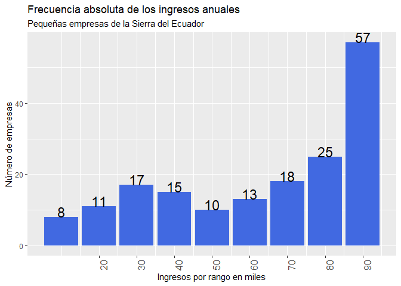
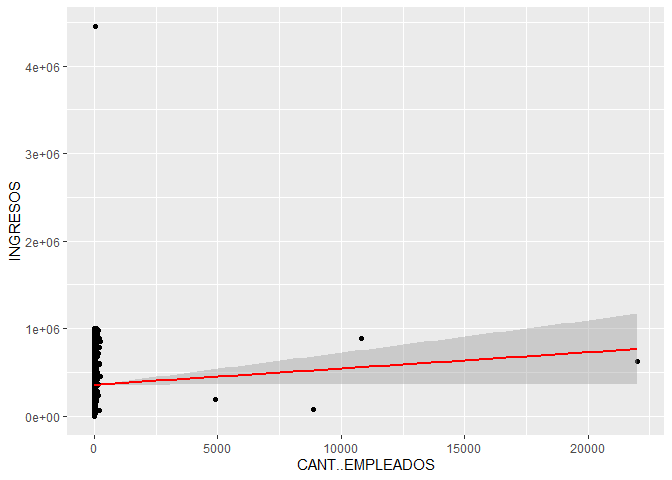
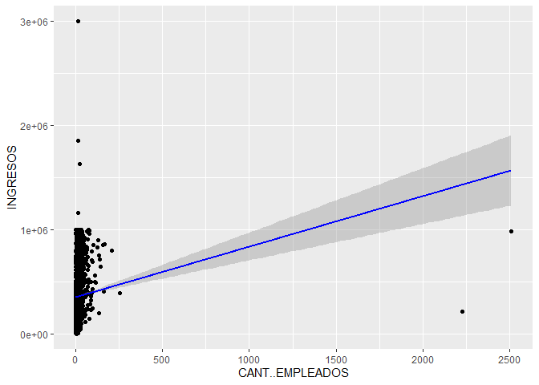

Tarea Betamétrica
================
Richard Guanoluisa
2023-11-06

# Carga librerías

``` r
library(openxlsx)
library(dplyr)
```

    ## 
    ## Attaching package: 'dplyr'

    ## The following objects are masked from 'package:stats':
    ## 
    ##     filter, lag

    ## The following objects are masked from 'package:base':
    ## 
    ##     intersect, setdiff, setequal, union

``` r
library(ggplot2)
library(fdth)
```

    ## 
    ## Attaching package: 'fdth'

    ## The following objects are masked from 'package:stats':
    ## 
    ##     sd, var

``` r
library(stringr)
library(stargazer)
```

    ## 
    ## Please cite as:

    ##  Hlavac, Marek (2022). stargazer: Well-Formatted Regression and Summary Statistics Tables.

    ##  R package version 5.2.3. https://CRAN.R-project.org/package=stargazer

``` r
library(lmtest)
```

    ## Loading required package: zoo

    ## 
    ## Attaching package: 'zoo'

    ## The following objects are masked from 'package:base':
    ## 
    ##     as.Date, as.Date.numeric

# Carga datos

``` r
# Cargar datos en datos_db
datos_db <- read.xlsx("C:\\Users\\Richard\\Documents\\DOCS RICHARD\\Cursos\\2023 Reto betametrica/empresas_HEBM18.xlsx",na.strings = T)
# Filtrar datos completos
datos_db <- datos_db %>% 
  filter(complete.cases(.))
```

# 1. Realizar un gráfico de barras considerando las empresas de la región SIERRA

``` r
# Resumen del conjunto de datos
summary(datos_db)
```

    ##      2019               2018                PR             EXPEDIENTE       
    ##  Length:19121       Length:19121       Length:19121       Length:19121      
    ##  Class :character   Class :character   Class :character   Class :character  
    ##  Mode  :character   Mode  :character   Mode  :character   Mode  :character  
    ##                                                                             
    ##                                                                             
    ##                                                                             
    ##     NOMBRE          TIPO.COMPAÑIA      ACTIVIDAD.ECONÓMICA    REGIÓN         
    ##  Length:19121       Length:19121       Length:19121        Length:19121      
    ##  Class :character   Class :character   Class :character    Class :character  
    ##  Mode  :character   Mode  :character   Mode  :character    Mode  :character  
    ##                                                                              
    ##                                                                              
    ##                                                                              
    ##   PROVINCIA            CIUDAD             TAMAÑO             SECTOR         
    ##  Length:19121       Length:19121       Length:19121       Length:19121      
    ##  Class :character   Class :character   Class :character   Class :character  
    ##  Mode  :character   Mode  :character   Mode  :character   Mode  :character  
    ##                                                                             
    ##                                                                             
    ##                                                                             
    ##  CANT..EMPLEADOS        ACTIVO            PATRIMONIO       INGRESOS.POR.VENTA
    ##  Min.   :    0.00   Min.   :        0   Min.   :-9926290   Min.   :      0   
    ##  1st Qu.:    4.00   1st Qu.:    75428   1st Qu.:   12690   1st Qu.: 137470   
    ##  Median :    6.00   Median :   187096   Median :   46851   Median : 250184   
    ##  Mean   :   12.78   Mean   :   561708   Mean   :  233994   Mean   : 321552   
    ##  3rd Qu.:   10.00   3rd Qu.:   428543   3rd Qu.:  139405   3rd Qu.: 465833   
    ##  Max.   :22008.00   Max.   :243754719   Max.   :64080222   Max.   :4448772   
    ##     UTILIDAD            INGRESOS      
    ##  Min.   :-973982.2   Min.   :      0  
    ##  1st Qu.:    789.9   1st Qu.: 137470  
    ##  Median :   7628.3   Median : 250184  
    ##  Mean   :  26786.3   Mean   : 321552  
    ##  3rd Qu.:  22872.4   3rd Qu.: 465833  
    ##  Max.   : 994057.8   Max.   :4448772

``` r
# Asignar datos limpios y filtrados a new_db
new_db <- datos_db %>% 
  select(NOMBRE,REGIÓN,PROVINCIA,INGRESOS,CANT..EMPLEADOS,UTILIDAD,CIUDAD) %>% 
  filter(REGIÓN == "SIERRA")
# Reducción de valores
new_db$INGRESOS <- new_db$INGRESOS/1000
# Histograma de Ingresos 
summary(new_db$INGRESOS)
```

    ##    Min. 1st Qu.  Median    Mean 3rd Qu.    Max. 
    ##     0.0   142.2   258.0   326.3   471.5  2994.4

``` r
tabla_frecuencia <- fdt(new_db$INGRESOS,start = 10,end = 100,h=10)
tabla_frecuencia1 <- data.frame(tabla_frecuencia$table)
tabla_frecuencia1$rango <- seq(20,100,10)
tabla_frecuencia1$cf... <- round(tabla_frecuencia1$cf...,0)
View(tabla_frecuencia1)
# Gráfico del histograma 
g1 <- ggplot(data = tabla_frecuencia1,
       aes(x=seq(10,90,10),
           y=f)) + 
  geom_bar(stat = "identity",fill="royalblue")+
  geom_text(aes(label=f),position="identity",vjust=0,size=6)+
  scale_x_continuous(breaks = tabla_frecuencia1$rango)+
  theme(axis.text.x = element_text(size = 12,angle = 90))+
  labs(title = "Frecuencia absoluta de los ingresos anuales",subtitle = "Pequeñas empresas de la Sierra del Ecuador")+
  xlab("Ingresos por rango en miles")+
  ylab("Número de empresas")
g1
```

<!-- -->

# 2. Realiza una regresión simple que explique el ingreso en función de la cantidad de empleados. Para efectos del ejercicio, se debe filtrar los casos cuyo ingreso y cantidad de empleados sea igual a 0. La regresión sólo debe construirse usando la provincia del Guayas. Se debe reportar los resultados, la interpretación de los coeficientes, las pruebas de autocorrelación, heterocedasticidad.

``` r
# Directorio
setwd("C:\\Users\\Richard\\Documents\\DOCS RICHARD\\Cursos\\2023 Reto betametrica\\Tarea Betamétrica/")
# Archivo
db_r <- openxlsx::read.xlsx("empresas_HEBM18.xlsx")
# asginar datos filtrados a db_r
db_r_fil <- db_r %>% 
  select(PROVINCIA,INGRESOS,CANT..EMPLEADOS) %>% 
  filter(INGRESOS>0 & CANT..EMPLEADOS>0 & PROVINCIA== "GUAYAS                                            ")
db_r_fil_1 <- db_r_fil %>% 
  select(INGRESOS,CANT..EMPLEADOS)
summary(db_r_fil_1)
```

    ##     INGRESOS       CANT..EMPLEADOS   
    ##  Min.   :    301   Min.   :    1.00  
    ##  1st Qu.: 160883   1st Qu.:    4.00  
    ##  Median : 277955   Median :    6.00  
    ##  Mean   : 354438   Mean   :   15.78  
    ##  3rd Qu.: 493443   3rd Qu.:    9.00  
    ##  Max.   :4448772   Max.   :22008.00

``` r
modelo <- lm(INGRESOS~.,data = db_r_fil_1)
summary(modelo)
```

    ## 
    ## Call:
    ## lm(formula = INGRESOS ~ ., data = db_r_fil_1)
    ## 
    ## Residuals:
    ##     Min      1Q  Median      3Q     Max 
    ## -439268 -193574  -76563  138947 4093811 
    ## 
    ## Coefficients:
    ##                  Estimate Std. Error t value Pr(>|t|)    
    ## (Intercept)     3.541e+05  3.028e+03  116.94   <2e-16 ***
    ## CANT..EMPLEADOS 1.852e+01  9.357e+00    1.98   0.0478 *  
    ## ---
    ## Signif. codes:  0 '***' 0.001 '**' 0.01 '*' 0.05 '.' 0.1 ' ' 1
    ## 
    ## Residual standard error: 248200 on 6732 degrees of freedom
    ## Multiple R-squared:  0.0005818,  Adjusted R-squared:  0.0004333 
    ## F-statistic: 3.919 on 1 and 6732 DF,  p-value: 0.04779

``` r
#ingresos = intercepto +b * cant empleado +error
#ingresos = 3.541+1.852*cant empleados
#Gráficos
grafico1=ggplot(db_r_fil_1,aes(CANT..EMPLEADOS,INGRESOS))
grafico1+geom_point()+geom_smooth(method = "lm",colour="Red")
```

    ## `geom_smooth()` using formula = 'y ~ x'

<!-- -->

``` r
# Prueba de autocorrelación
modelo_corr <- dwtest(modelo) 
print(modelo_corr)
```

    ## 
    ##  Durbin-Watson test
    ## 
    ## data:  modelo
    ## DW = 1.6932, p-value < 2.2e-16
    ## alternative hypothesis: true autocorrelation is greater than 0

``` r
# Prueba de heterocedasticidad
bptest_result <- bptest(modelo)
print(bptest_result)
```

    ## 
    ##  studentized Breusch-Pagan test
    ## 
    ## data:  modelo
    ## BP = 0.10759, df = 1, p-value = 0.7429

``` r
# Respuesta
# Por cada empleado se añade 18.45 en los ingresos, sin embargo, debido al bajísimo valor de R-squared, 
# o existe gran impacto del número de empleados para aumentar los ingesos.
# el gráfico 1 muestra que no existe la relación lineal entre las variables.
# autocorrelación
# DW=1.69 no existe alta correlación entre las variables
# heterocedasticidad
# p es 0.7429, por lo que no hay suficiente evidencia para rechazar la hipótesis nula.
```

# 3. Realiza el mismo ejercicio del enunciado anterior, pero para pichincha. En este caso, sólo reporta los resultados y la explicación de los coeficiente.

``` r
# Directorio
setwd("C:\\Users\\Richard\\Documents\\DOCS RICHARD\\Cursos\\2023 Reto betametrica\\Tarea Betamétrica/")
# Archivo
db_r <- openxlsx::read.xlsx("empresas_HEBM18.xlsx")
# asginar datos filtrados a db_r
db_r_fil_P <- db_r %>% 
  select(PROVINCIA,INGRESOS,CANT..EMPLEADOS) %>% 
  filter(INGRESOS>0 & CANT..EMPLEADOS>0 & PROVINCIA== "PICHINCHA                                         ")
db_r_fil_P1 <- db_r_fil_P %>% 
  select(INGRESOS,CANT..EMPLEADOS)
summary(db_r_fil_P1)
```

    ##     INGRESOS       CANT..EMPLEADOS  
    ##  Min.   :    120   Min.   :   1.00  
    ##  1st Qu.: 164474   1st Qu.:   4.00  
    ##  Median : 289015   Median :   6.00  
    ##  Mean   : 357058   Mean   :  10.24  
    ##  3rd Qu.: 493858   3rd Qu.:  10.00  
    ##  Max.   :2994430   Max.   :2509.00

``` r
modelo_P <- lm(INGRESOS~.,data = db_r_fil_P1)
summary(modelo_P)
```

    ## 
    ## Call:
    ## lm(formula = INGRESOS ~ ., data = db_r_fil_P1)
    ## 
    ## Residuals:
    ##      Min       1Q   Median       3Q      Max 
    ## -1221454  -190986   -67949   135604  2635552 
    ## 
    ## Coefficients:
    ##                  Estimate Std. Error t value Pr(>|t|)    
    ## (Intercept)     352108.24    3068.54  114.75  < 2e-16 ***
    ## CANT..EMPLEADOS    483.54      68.68    7.04 2.12e-12 ***
    ## ---
    ## Signif. codes:  0 '***' 0.001 '**' 0.01 '*' 0.05 '.' 0.1 ' ' 1
    ## 
    ## Residual standard error: 237500 on 6321 degrees of freedom
    ## Multiple R-squared:  0.007781,   Adjusted R-squared:  0.007624 
    ## F-statistic: 49.57 on 1 and 6321 DF,  p-value: 2.12e-12

``` r
#ingresos = intercept +b * cant empleado +error
#ingresos = 352108.24+483.54*cant empleados

#Gráficos
grafico2=ggplot(db_r_fil_P1,aes(CANT..EMPLEADOS,INGRESOS))
grafico2+geom_point()+geom_smooth(method = "lm",colour="Blue")
```

    ## `geom_smooth()` using formula = 'y ~ x'

<!-- -->

``` r
# Prueba de autocorrelación
modelo_corr_P <- dwtest(modelo_P) 
print(modelo_corr_P)
```

    ## 
    ##  Durbin-Watson test
    ## 
    ## data:  modelo_P
    ## DW = 1.5408, p-value < 2.2e-16
    ## alternative hypothesis: true autocorrelation is greater than 0

``` r
# Prueba de heterocedasticidad
bptest_result_P <- bptest(modelo_P)
print(bptest_result_P)
```

    ## 
    ##  studentized Breusch-Pagan test
    ## 
    ## data:  modelo_P
    ## BP = 126.92, df = 1, p-value < 2.2e-16

``` r
# Respuesta
# Por cada empleado se añade 483.54 en los ingresos, sin embargo, debido al bajísimo valor de R-squared, 
# no existe gran impacto del número de empleados para aumentar los ingesos.
# A diferencia de Guayas, el número de empleados tiene mayor impacto en la generación de INGRESOS en Pichincha
# el gráfico 1_P muestra que no existe la relación lineal entre las variables.
# autocorrelación
# DW=1.54 no existe alta correlación entre las variables
# heterocedasticidad
# No hay suficiente evidencia para rechazar la hipótesis nula.
```
